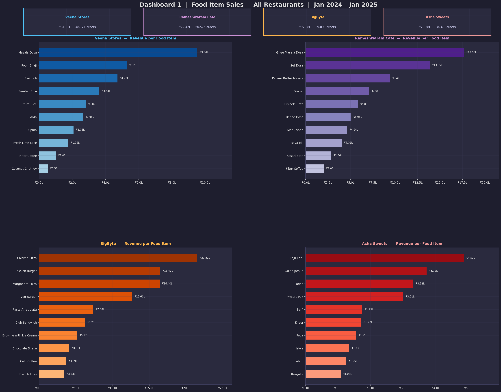
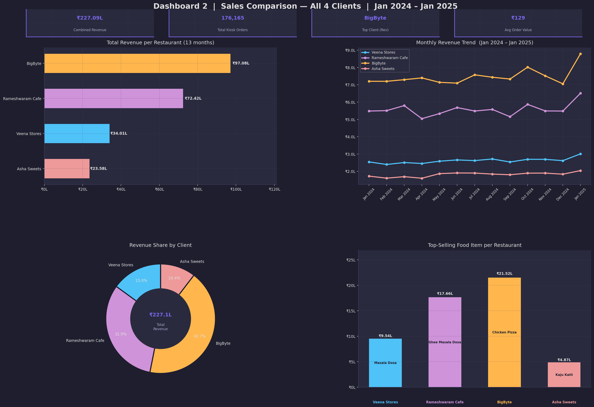

# Sales Data Analytics Project

## Overview
This project focuses on analyzing sales data to identify trends, calculate monthly profit & loss, and visualize key insights through interactive dashboards.  
The workflow includes **data cleaning**, **exploratory data analysis (EDA)**, and **dashboard creation** using Python and Power BI.

---

## Addition Technologies Pvt Ltd – Self-Serve Kiosk Sales Dashboard

### Business Context
**Addition Technologies Pvt Ltd** provides self-serve food ordering kiosks to restaurants in Bangalore.

**Client Restaurants:**
| Restaurant | Cuisine / Type |
|---|---|
| Veena Stores | South Indian Tiffin |
| Rameshwaram Cafe | South Indian Cafe |
| BigByte | Fast Food / Cafe |
| Asha Sweets | Sweets & Desserts |

### Dashboard Goals
| Dashboard | Audience | Purpose |
|---|---|---|
| **Dashboard 1 – Food Item Sales (All Restaurants)** | Addition Technologies + each client | All 4 restaurants in one view — food-item revenue ranked per outlet |
| **Dashboard 2 – Sales Comparison** | Addition Technologies | Simple comparison of all 4 clients: total revenue, monthly trends, share, top items |

---

## Project Structure
```
Sales-Data-Analysis/
│
├── README.md                        # Project documentation
│
├── kiosk_sales_data.csv             # Kiosk sales dataset (Jan 2024 – Jan 2025, all 4 restaurants)
├── kiosk_sales_data.xlsx            # Excel workbook: Raw Data + Monthly Summary + per-restaurant sheets
├── Kiosk_Dashboard.pbids            # Power BI Desktop one-click connection file
├── Kiosk_Sales_Analysis.ipynb       # Analysis notebook: per-restaurant + company dashboards
│
├── dashboards/                      # Exported dashboard images (PNG, 150 dpi)
│   ├── Dashboard1_All_Restaurants_Food_Item_Sales.png
│   └── Dashboard2_Sales_Comparison.png
│
├── Cleaned_Superstore_Sales.csv     # Superstore reference dataset (cleaned)
├── Sample - Superstore.csv          # Superstore reference dataset (raw)
├── Superstore_data_analysis.ipynb   # Superstore EDA notebook
└── Sales_Data_Dashboard.pbix        # Superstore Power BI dashboard file
```

---

## Kiosk Sales Dataset (`kiosk_sales_data.csv`)

| Column | Description |
|---|---|
| `Order_ID` | Unique kiosk order identifier |
| `Date` | Order date (YYYY-MM-DD) |
| `Month` | Year-month (YYYY-MM) |
| `Month_Name` | Human-readable month label |
| `Restaurant` | Client restaurant name |
| `Category` | Food category (Breakfast, Beverages, etc.) |
| `Food_Item` | Name of the food/drink ordered |
| `Unit_Price` | Price per unit (₹) |
| `Quantity` | Number of units ordered |
| `Discount_Pct` | Discount percentage applied |
| `Discount_Amount` | Discount amount (₹) |
| `Total_Sales` | Final billed amount (₹) |
| `Customer_ID` | Customer identifier (used for footfall tracking) |

---

## Technologies Used
- **Python** (Pandas, NumPy, Matplotlib, Seaborn)
- **Jupyter Notebook**
- **Power BI** (for dashboards)
- **Excel** (data review & validation)

---

## Dashboard Previews

### Dashboard 1 – Food Item Sales for All 4 Restaurants (single combined view)


### Dashboard 2 – Sales Comparison across All 4 Clients


---

## Running the Analysis

```bash
pip install pandas numpy matplotlib seaborn jupyter
jupyter notebook Kiosk_Sales_Analysis.ipynb
```

---

## Power BI Dashboard Setup

### Option A – Fastest: Open the `.pbids` connection file
1. Install **Power BI Desktop** (free from [Microsoft Store](https://apps.microsoft.com/store/detail/power-bi-desktop))
2. Copy `Kiosk_Dashboard.pbids` to the same folder as `kiosk_sales_data.csv`
3. Double-click `Kiosk_Dashboard.pbids` — Power BI Desktop opens and imports the CSV automatically

### Option B – Import from Excel
1. Open Power BI Desktop → *Get Data → Excel Workbook*
2. Select `kiosk_sales_data.xlsx`
3. Check all sheets: **Raw Data**, **Monthly Summary**, **Footfall Summary**, and the four per-restaurant sheets
4. Click **Load**

### Step 2 – Build Dashboard 1 (Food Item Sales — All Restaurants in One Page)
Use **Small Multiples** in Power BI to show all 4 restaurants on a single page automatically:

| Visual | Type | Fields |
|---|---|---|
| Food Item Revenue (all restaurants) | Horizontal Bar with **Small Multiples** | Axis: `Food_Item` · Value: `Sum(Total_Sales)` · Small multiples: `Restaurant` |
| KPI Cards (×4) | Card | Total Revenue · Total Orders (one per restaurant, filtered by slicer) |

> **Power BI tip:** In the Bar Chart settings, drag `Restaurant` into the **Small Multiples** field well — Power BI automatically creates a 2×2 grid showing each restaurant's food item sales in a single visual on one page.

### Step 3 – Build Dashboard 2 (Simple Sales Comparison)
| Visual | Type | Fields |
|---|---|---|
| Total Revenue by Restaurant | Horizontal Bar Chart | Axis: `Restaurant` · Value: `Sum(Total_Sales)` |
| Monthly Revenue Trend | Line Chart | X: `Month_Name` · Y: `Sum(Total_Sales)` · Legend: `Restaurant` |
| Revenue Share | Donut Chart | Legend: `Restaurant` · Value: `Sum(Total_Sales)` |
| Top Food Item per Restaurant | Horizontal Bar (filtered to rank 1 per restaurant) | Axis: `Food_Item` · Value: `Sum(Total_Sales)` · use DAX below |

```dax
-- Top food item per restaurant: add a rank column or use this measure
Top Item Revenue =
    CALCULATE(
        SUM(kiosk_sales_data[Total_Sales]),
        TOPN(1,
             VALUES(kiosk_sales_data[Food_Item]),
             CALCULATE(SUM(kiosk_sales_data[Total_Sales])), DESC)
    )
```

### Recommended DAX Measures
```dax
Total Revenue     = SUM(kiosk_sales_data[Total_Sales])
Total Orders      = COUNTROWS(kiosk_sales_data)
Avg Order Value   = AVERAGE(kiosk_sales_data[Total_Sales])
Total Footfall    = COUNTROWS(kiosk_sales_data)

MoM Revenue Growth % =
    VAR current  = [Total Revenue]
    VAR previous = CALCULATE([Total Revenue], DATEADD(kiosk_sales_data[Date], -1, MONTH))
    RETURN DIVIDE(current - previous, previous, 0) * 100
```

---

## Key Insights & Outcomes
- 🏆 **Rameshwaram Cafe** drives the highest customer footfall (60,575 kiosk orders) — highest self-serve kiosk adoption.
- 💰 Total company revenue across all 4 outlets: **₹227.09 Lakhs** (Jan 2024 – Jan 2025, 13 months).
- 🍽️ Top-selling item at Rameshwaram Cafe: **Ghee Masala Dosa** (₹17.66L revenue).
- 📅 Highest revenue month: **January 2025** — new monthly record at ₹20.36L combined.
- 📊 BigByte has the highest average order value (₹248+) despite lower footfall count.
