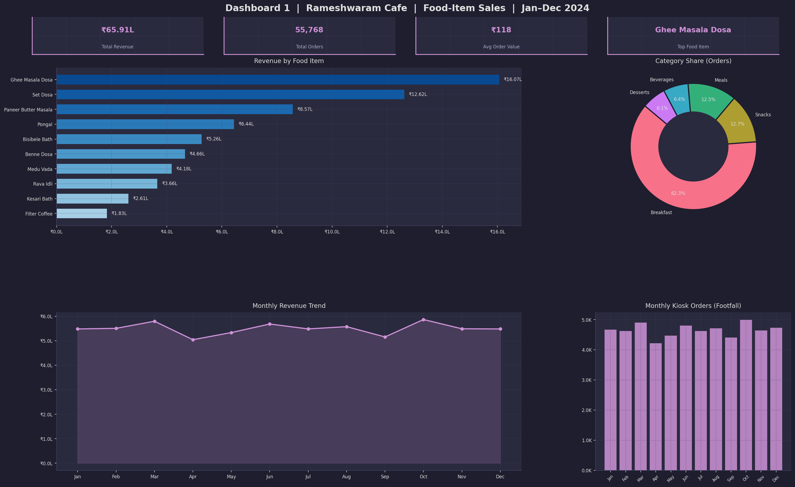
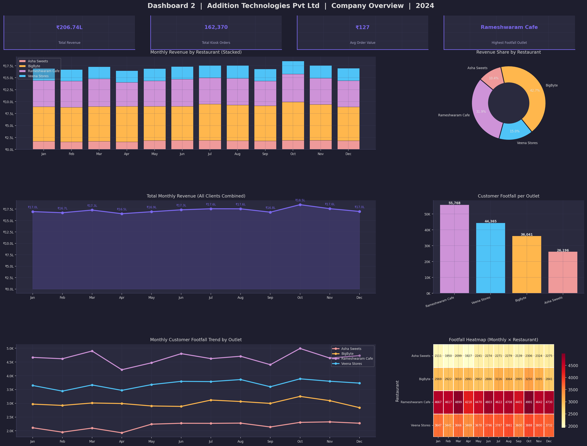

# Sales Data Analytics Project

## Overview
This project focuses on analyzing sales data to identify trends, calculate monthly profit & loss, and visualize key insights through interactive dashboards.  
The workflow includes **data cleaning**, **exploratory data analysis (EDA)**, and **dashboard creation** using Python and Power BI.

---

## Addition Technologies Pvt Ltd – Self-Serve Kiosk Sales Dashboard

### Business Context
**Addition Technologies Pvt Ltd** provides self-serve food ordering kiosks to restaurants in Bangalore.

**Client Restaurants:**
| Restaurant | Cuisine / Type |
|---|---|
| Veena Stores | South Indian Tiffin |
| Rameshwaram Cafe | South Indian Cafe |
| BigByte | Fast Food / Cafe |
| Asha Sweets | Sweets & Desserts |

### Dashboard Goals
| Dashboard | Audience | Purpose |
|---|---|---|
| **Dashboard 1 – Per-Restaurant** | Each client restaurant | Food-item wise sales & revenue, category split, monthly trend |
| **Dashboard 2 – Company Overview** | Addition Technologies | Monthly revenue across all clients, customer footfall per outlet, highest kiosk usage location |

---

## Project Structure
```
Sales-Data-Analysis/
│
├── README.md                        # Project documentation
│
├── kiosk_sales_data.csv             # Kiosk sales dataset (Jan–Dec 2024, all 4 restaurants)
├── kiosk_sales_data.xlsx            # Excel workbook: Raw Data + Monthly Summary + per-restaurant sheets
├── Kiosk_Dashboard.pbids            # Power BI Desktop one-click connection file
├── Kiosk_Sales_Analysis.ipynb       # Analysis notebook: per-restaurant + company dashboards
│
├── dashboards/                      # Exported dashboard images (PNG, 150 dpi)
│   ├── Dashboard1_Veena_Stores.png
│   ├── Dashboard1_Rameshwaram_Cafe.png
│   ├── Dashboard1_BigByte.png
│   ├── Dashboard1_Asha_Sweets.png
│   └── Dashboard2_Company_Overview.png
│
├── Cleaned_Superstore_Sales.csv     # Superstore reference dataset (cleaned)
├── Sample - Superstore.csv          # Superstore reference dataset (raw)
├── Superstore_data_analysis.ipynb   # Superstore EDA notebook
└── Sales_Data_Dashboard.pbix        # Superstore Power BI dashboard file
```

---

## Kiosk Sales Dataset (`kiosk_sales_data.csv`)

| Column | Description |
|---|---|
| `Order_ID` | Unique kiosk order identifier |
| `Date` | Order date (YYYY-MM-DD) |
| `Month` | Year-month (YYYY-MM) |
| `Month_Name` | Human-readable month label |
| `Restaurant` | Client restaurant name |
| `Category` | Food category (Breakfast, Beverages, etc.) |
| `Food_Item` | Name of the food/drink ordered |
| `Unit_Price` | Price per unit (₹) |
| `Quantity` | Number of units ordered |
| `Discount_Pct` | Discount percentage applied |
| `Discount_Amount` | Discount amount (₹) |
| `Total_Sales` | Final billed amount (₹) |
| `Customer_ID` | Customer identifier (used for footfall tracking) |

---

## Technologies Used
- **Python** (Pandas, NumPy, Matplotlib, Seaborn)
- **Jupyter Notebook**
- **Power BI** (for dashboards)
- **Excel** (data review & validation)

---

## Dashboard Previews

### Dashboard 1 – Per-Restaurant (Rameshwaram Cafe example)


### Dashboard 2 – Company Overview (Addition Technologies)


---

## Running the Analysis

```bash
pip install pandas numpy matplotlib seaborn jupyter
jupyter notebook Kiosk_Sales_Analysis.ipynb
```

---

## Power BI Dashboard Setup

### Option A – Fastest: Open the `.pbids` connection file
1. Install **Power BI Desktop** (free from [Microsoft Store](https://apps.microsoft.com/store/detail/power-bi-desktop))
2. Copy `Kiosk_Dashboard.pbids` to the same folder as `kiosk_sales_data.csv`
3. Double-click `Kiosk_Dashboard.pbids` — Power BI Desktop opens and imports the CSV automatically

### Option B – Import from Excel
1. Open Power BI Desktop → *Get Data → Excel Workbook*
2. Select `kiosk_sales_data.xlsx`
3. Check all sheets: **Raw Data**, **Monthly Summary**, **Footfall Summary**, and the four per-restaurant sheets
4. Click **Load**

### Step 2 – Build Dashboard 1 (Per-Restaurant View)
Add a **Slicer** on the `Restaurant` field so each client can filter to their outlet, then add:

| Visual | Type | Fields |
|---|---|---|
| Food Item Revenue | Horizontal Bar | Axis: `Food_Item` · Value: `Sum(Total_Sales)` |
| Food Item Orders | Column Chart | Axis: `Food_Item` · Value: `Count(Order_ID)` |
| Category Split | Donut Chart | Legend: `Category` · Value: `Sum(Total_Sales)` |
| Monthly Revenue | Line Chart | X-axis: `Month` · Y-axis: `Sum(Total_Sales)` |
| KPI Cards | Card | Total Revenue · Total Orders · Avg Order Value |

### Step 3 – Build Dashboard 2 (Company Overview)
| Visual | Type | Fields |
|---|---|---|
| Monthly Revenue (all clients) | Stacked Bar | X: `Month` · Y: `Sum(Total_Sales)` · Legend: `Restaurant` |
| Total Footfall by Outlet | Bar Chart | Axis: `Restaurant` · Value: `Count(Order_ID)` |
| Revenue Share | Pie / Donut | Legend: `Restaurant` · Value: `Sum(Total_Sales)` |
| Monthly Footfall Trend | Multi-line Chart | X: `Month` · Y: `Count(Order_ID)` · Legend: `Restaurant` |
| Footfall Heatmap | Matrix | Rows: `Restaurant` · Columns: `Month_Name` · Values: `Count(Order_ID)` |

### Recommended DAX Measures
```dax
Total Revenue     = SUM(kiosk_sales_data[Total_Sales])
Total Orders      = COUNTROWS(kiosk_sales_data)
Avg Order Value   = AVERAGE(kiosk_sales_data[Total_Sales])
Total Footfall    = COUNTROWS(kiosk_sales_data)

MoM Revenue Growth % =
    VAR current  = [Total Revenue]
    VAR previous = CALCULATE([Total Revenue], DATEADD(kiosk_sales_data[Date], -1, MONTH))
    RETURN DIVIDE(current - previous, previous, 0) * 100
```

---

## Key Insights & Outcomes
- 🏆 **Rameshwaram Cafe** drives the highest customer footfall (55,768 kiosk orders) — highest self-serve kiosk adoption.
- 💰 Total company revenue across all 4 outlets: **₹206.74 Lakhs** (Jan–Dec 2024).
- 🍽️ Top-selling item at Rameshwaram Cafe: **Ghee Masala Dosa** (₹16.07L revenue).
- 📅 Peak revenue month: **October 2024** (festival season uplift).
- 📊 BigByte has the highest average order value (₹199+) despite lower footfall count.
